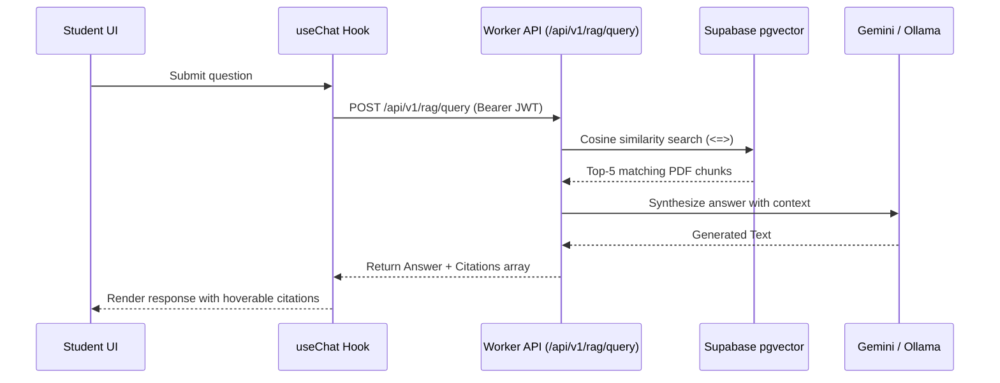
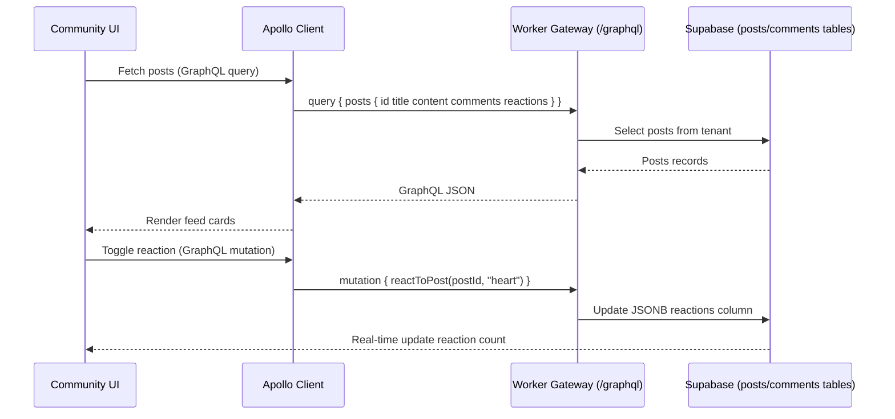

# Chat-NCERT: Frontend Pages & Navigation Mapping (Detailed Guide)

This document provides a detailed breakdown of how each page operates, the specific user flows, the data fetching methods (REST vs. GraphQL), and how the routes link together.

---

## 1. Authentication Flow & Role-Based Routing

```mermaid
graph TD
    Login[User inputs email & password on /login] --> BetterAuth[Better-Auth processes request]
    BetterAuth --> Session[Session cookie set & Zustand state updated]
    Session --> RoleCheck{Check user.role}
    RoleCheck -- student --> StudentDashboard[/dashboard]
    RoleCheck -- instructor --> InstructorDashboard[/instructor]
    RoleCheck -- tenant_admin --> TenantAdmin[/admin]
    RoleCheck -- super_admin --> SuperAdmin[/super-admin]
```

### Route: `/login`
*   **Aesthetics:** Translucent glassmorphism card centered on a HSL gradient background, using modern input elements (floating labels) and micro-animations on hover.
*   **Form Schema (Zod):** `loginSchema` (validates email structure, password minimum 6 chars).
*   **State Management:**
    *   Calls Better-Auth `signIn.email({ email, password })`.
    *   On success, updates Zustand store with user profile: `{ id, email, name, role, tenantId }`.
*   **Navigation Trigger:** Client reads `user.role` from state and redirects using `next/navigation` router:
    *   `student` $\rightarrow$ `/dashboard`
    *   `instructor` $\rightarrow$ `/instructor`
    *   `tenant_admin` $\rightarrow$ `/admin`
    *   `super_admin` $\rightarrow$ `/super-admin`

---

## 2. Student Workspace (`/dashboard`)

When a student logs in, they enter `/dashboard`. All routes here share a **common Sidebar Layout** (`/dashboard/layout.tsx`).

### Dynamic Navigation Sidebar
The sidebar displays the student's name and class. It contains links to the following routes:
1.  **Home** (`/dashboard`)
2.  **NCERT Q&A (RAG)** (`/dashboard/rag`)
3.  **Community Hub** (`/dashboard/community`)
4.  **Practice Quizzes** (`/dashboard/quizzes`)
5.  **Assignments** (`/dashboard/assignments`)

---

### Flow 2.1: NCERT Q&A (`/dashboard/rag`)
Allows students to ask AI questions about NCERT textbooks and get answers with clickable page citations.



*   **UI Layout:**
    *   A clean scrollable chat feed (alternating user and assistant bubbles).
    *   Assistant bubbles render Markdown text.
    *   Citations (e.g. `[Class 10 Science, Page 14]`) are rendered as clickable pill badges.
*   **Data Fetching:**
    *   Uses standard HTTP `fetch` to POST `{ question: string }` to the Worker REST endpoint `/api/v1/rag/query`.
    *   Passes the user's Better-Auth JWT token in the `Authorization: Bearer <JWT>` header.
*   **User Interactions:**
    *   Hovering over a citation badge opens a tooltip previewing the raw chunk text.
    *   Clicking the citation badge opens a modal displaying the PDF page fetched from the Cloudflare R2 bucket.

---

### Flow 2.2: Community Hub (`/dashboard/community`)
A discussion board where students post questions, react, and discuss NCERT topics.



*   **UI Layout:**
    *   **Post Creator:** Text inputs on top of the feed to add title and content with a collapse-expand animation.
    *   **Feed Cards:** Cards displaying author, date, title, body, reaction badges, and a "Comments" toggle button.
*   **GraphQL Integration:**
    *   **Query `getPosts`:** Fetches feed posts.
    *   **Mutation `createPost`:** Fired when a student submits a new post.
    *   **Mutation `createComment`:** Adds a comment.
    *   **Mutation `reactToPost`:** Toggle reaction array inside PostgreSQL JSONB column.
*   **User Interactions:**
    *   Clicking comments slide-opens the comment panel. Comments are nested and rendered recursively.

---

### Flow 2.3: Quiz Taker (`/dashboard/quizzes/[id]`)
Interactive practice quiz interface.

*   **UI Layout:**
    *   **Step Wizard:** Displays only one question card at a time. Options are rendered as select pills.
    *   **Progress Bar:** Shows current question number / total questions.
    *   **Timer Badge:** Displays countdown timer.
*   **Workflow:**
    *   Student navigates to `/dashboard/quizzes/[id]`.
    *   GraphQL query fetches the quiz structure: `Query { quiz(id) { title questions } }`.
    *   Student answers questions. Selecting an option saves it to local component state `answers: { [questionId]: selectedIndex }`.
    *   When the timer hits 0 or the student clicks "Submit Quiz", the wizard shows a loading skeleton.
    *   Triggers GraphQL mutation:
        ```graphql
        mutation SubmitAttempt($quizId: ID!, $answers: JSON!, $score: Int!, $timeTaken: Int!) {
          submitQuizAttempt(quizId: $quizId, answers: $answers, score: $score, timeTaken: $timeTaken) {
            id
            score
          }
        }
        ```
    *   Redirects back to `/dashboard/quizzes`, showing a success card with the scored attempt.

---

## 3. Instructor Portal (`/instructor`)

Layout has dynamic links for PDF uploads and Grading dashboards.

### Flow 3.1: Ingestion & Document Processing (`/instructor/documents`)
Instructors upload NCERT textbook PDFs to train the RAG model.

*   **UI Layout:**
    *   A file drop zone with drag-and-drop event handlers.
    *   Progress bar indicating file upload progress.
*   **Workflow:**
    *   Instructor drags a PDF file (e.g. `Biology_Ch2.pdf`), enters the Class (e.g. `Class 11`) and Subject (e.g. `Biology`).
    *   Fires standard `multipart/form-data` REST call `POST /api/v1/rag/ingest`.
    *   API Gateway Worker uploads the file directly to Cloudflare R2, saves the file metadata, and dispatches a task to QStash.
    *   QStash background job executes the parsing and pgvector embedding process asynchronously.
    *   UI lists the document as `Processing` (polling checking document status via GraphQL/REST). Once complete, status changes to `Ready`.

---

## 4. Admin Portal (`/admin`)

Used by the tenant admin to customize settings.

*   **UI Forms:**
    *   **Ollama Settings Form:** Text input to save/edit the tenant's public tunnel URL (`ollamaTunnelUrl`).
    *   **Branding Configuration:** Inputs for tenant name, uploading primary brand logo (uploaded to R2), and custom primary color schemes.
*   **Data Fetching:**
    *   Queries settings using GraphQL or REST.
    *   Updates the `tenants` table columns in Supabase.

---

## 5. Super Admin Portal (`/super-admin`)

Relies strictly on REST to secure operations.

*   **UI Forms:**
    *   **Provision Tenant Form:** Inputs for tenant name, initial email, and target plan tier (free, starter, pro).
*   **Workflow:**
    *   Admin clicks "Provision Tenant".
    *   Fires `POST /api/v1/admin/tenant`.
    *   API resolves:
        1. Generates a new tenant UUID.
        2. Generates a unique API key (`sk_live_...`).
        3. Creates the tenant database records.
    *   Displays the generated API Key in a password-reveal dialog. Admin copies it for onboarding.
